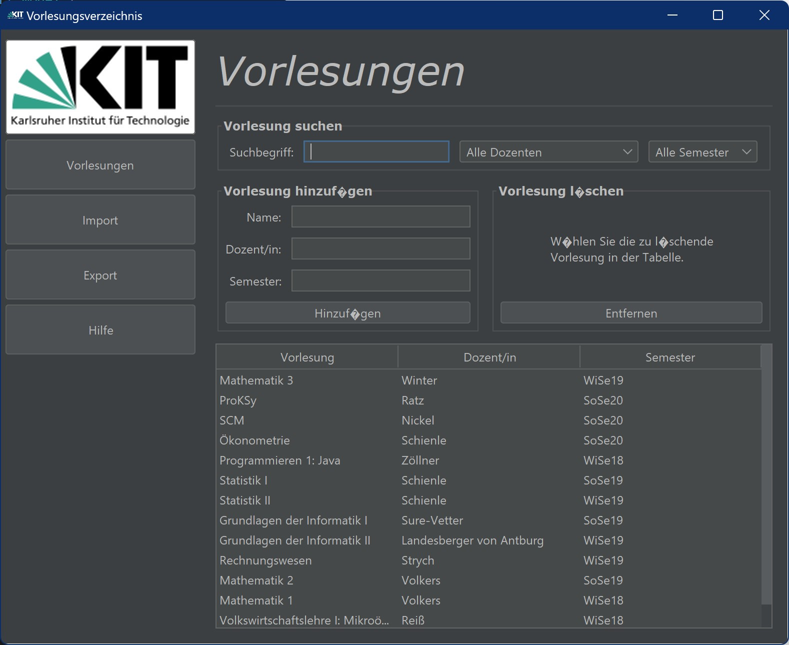
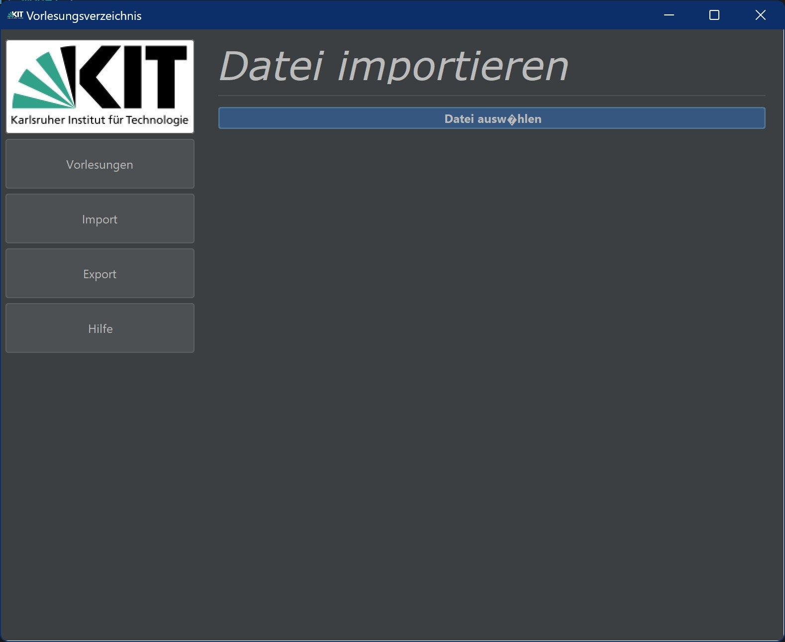
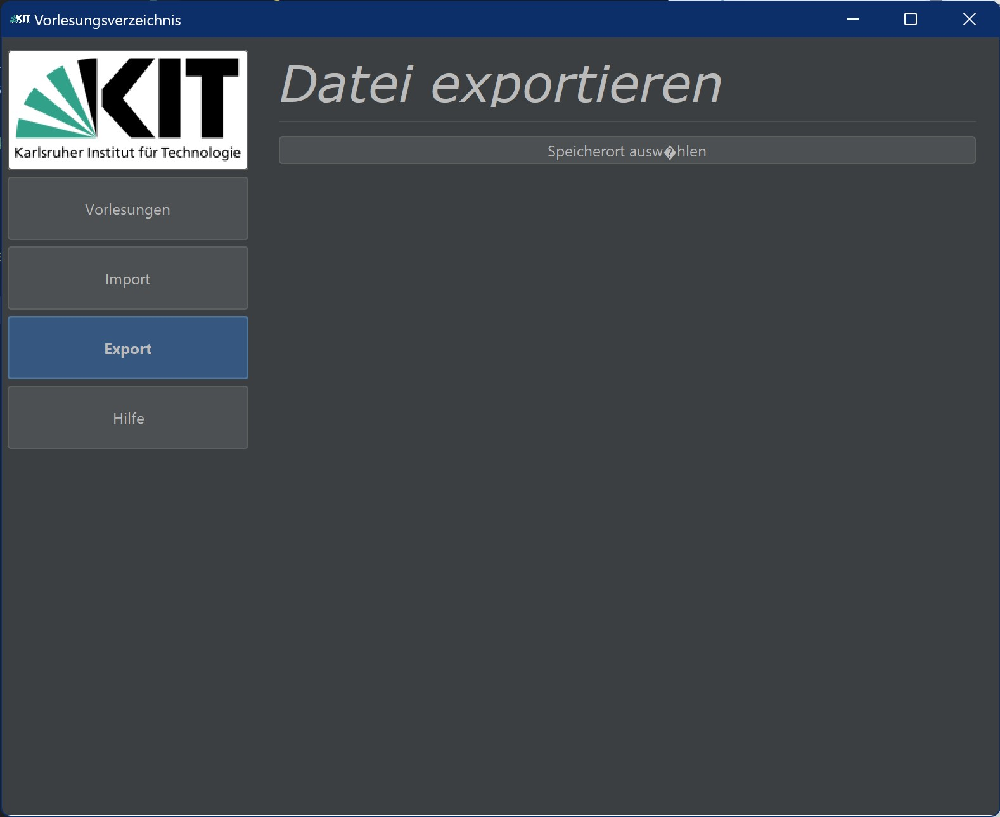
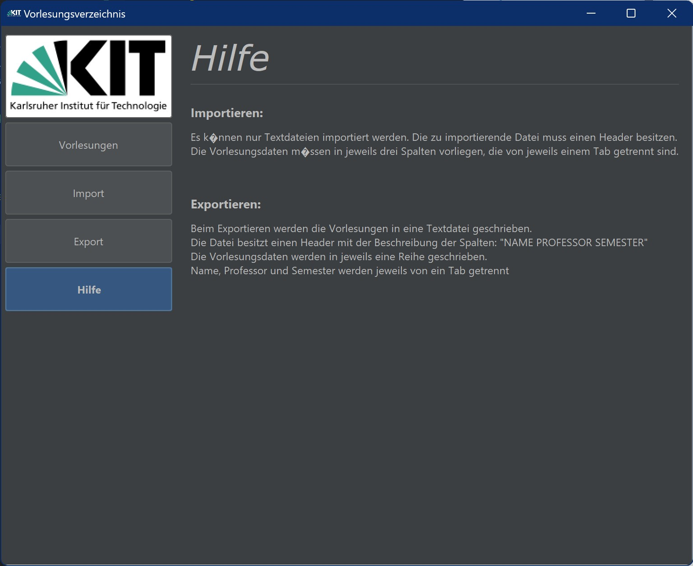

# course-directory-gui

A Java GUI for the management of university courses programmed following the [model-view-controller](https://en.wikipedia.org/wiki/Model%E2%80%93view%E2%80%93controller "Model–view–controller") principle.

## GUI Screenshots

